# 🚀 Premium Paketler - Tam Özellik Implementasyon Planı

## 🎯 Ana Hedef
`http://localhost:5173/upgrades` sayfasındaki tüm premium paketlerde (Silver, Gold, Platinum) yazılı olan özelliklerin sadece kağıt üzerinde değil, **gerçekten çalışan, operational bir sistem** haline getirilmesi.

## 🔍 Mevcut Durum Analizi

### ✅ Var Olanlar
- Subscription paketleri UI tanımlanmış
- Temel subscription kontrol mekanizması mevcut  
- Bazı servisler kısmen implement edilmiş (callService, translationService)
- Limit kontrolü hook'ları var

### ❌ Eksik/Çalışmayan Özellikler
- WebRTC servisi devre dışı (video/voice calls)
- Boost sistemi tamamen eksik
- Rewind özelliği yok
- Advanced filters implement edilmemiş
- See Who Likes You eksik
- Passport (lokasyon değiştirme) yok
- Invisible browsing eksik
- Top Picks yok
- Profile analytics yok
- Video profile upload yok

## 📋 Detaylı Implementasyon Planı

```mermaid
flowchart TD
    A[🎯 Premium Features Activation] --> B[1️⃣ Core Infrastructure]
    A --> C[2️⃣ Premium Discovery]
    A --> D[3️⃣ Communication Features]
    A --> E[4️⃣ Profile Features]
    A --> F[5️⃣ Analytics & Admin]

    B --> B1[Subscription Enforcement]
    B --> B2[Feature Gates]
    B --> B3[Usage Tracking]

    C --> C1[🚀 Boost System]
    C --> C2[⏮️ Rewind Feature]
    C --> C3[🔍 Advanced Filters]
    C --> C4[👀 See Who Likes You]
    C --> C5[🌍 Passport Feature]

    D --> D1[📞 WebRTC Video/Voice]
    D --> D2[🌐 Real-time Translation]
    D --> D3[✓ Read Receipts]
    D --> D4[⚡ Priority Messages]

    E --> E1[🎥 Video Profile]
    E --> E2[📊 Profile Analytics]
    E --> E3[✓ Verification Badge]
    E --> E4[📸 Max Photos Enforcement]

    F --> F1[📈 Analytics Dashboard]
    F --> F2[⚙️ Admin Enhancements]
    F --> F3[💰 Payment Analytics]
```



## 🛠️ Aşama 1: Core Infrastructure

### 1.1 Subscription Enforcement System
**Yeni Dosyalar:**
- `services/subscriptionEnforcement.ts` - ✅ Mevcut
- `hooks/useFeatureGate.tsx` - 🆕 Yeni
- `services/usageTracking.ts` - 🆕 Yeni

**Özellikler:**
- Real-time feature checking
- Dynamic feature enablement
- Usage limit tracking
- Automatic restriction system

### 1.2 Feature Gates Implementation
```typescript
// hooks/useFeatureGate.tsx
export const useFeatureGate = (feature: string) => {
  const { subscription_tier, features } = useSubscription();
  
  return {
    hasAccess: features[feature],
    requiresUpgrade: !features[feature],
    upgradeMessage: getUpgradeMessage(feature)
  };
};
```

## 🚀 Aşama 2: Premium Discovery Features

### 2.1 Boost System
**Yeni Dosyalar:**
- `services/boostService.ts` - 🆕 Yeni
- `components/boost/BoostModal.tsx` - 🆕 Yeni
- `hooks/useBoost.tsx` - 🆕 Yeni

**Database Tables:**
```sql
-- profile_boosts table
CREATE TABLE profile_boosts (
  id UUID PRIMARY KEY DEFAULT gen_random_uuid(),
  user_id UUID REFERENCES profiles(id),
  boost_type TEXT, -- 'profile', 'super_boost'
  duration_minutes INTEGER,
  started_at TIMESTAMPTZ,
  ends_at TIMESTAMPTZ,
  created_at TIMESTAMPTZ DEFAULT NOW()
);
```

### 2.2 Advanced Filters
**Yeni Dosyalar:**
- `services/filtersService.ts` - 🆕 Yeni
- `components/discovery/AdvancedFilters.tsx` - 🆝 Güncelle
- `hooks/useAdvancedFilters.tsx` - 🆕 Yeni

**Filter Types:**
- Age range (detailed)
- Distance (exact km)
- Education level
- Job categories
- Interests matching
- Height preferences
- Smoking/drinking preferences

### 2.3 See Who Likes You
**Yeni Dosyalar:**
- `pages/WhoLikesYou.tsx` - 🆕 Yeni
- `services/likesService.ts` - 🆕 Yeni
- `components/likes/LikesList.tsx` - 🆕 Yeni

### 2.4 Rewind Feature
**Yeni Dosyalar:**
- `services/rewindService.ts` - 🆕 Yeni
- `hooks/useRewind.tsx` - 🆕 Yeni
- `components/swipe/RewindButton.tsx` - 🆕 Yeni

## 📞 Aşama 3: Communication Features

### 3.1 WebRTC Implementation (Fix)
**Güncellenecek Dosyalar:**
- `services/webrtcService.ts` - 🔧 Fix & Enable
- `components/chat/CallInterface.tsx` - 🆕 Yeni
- `components/chat/VideoCallModal.tsx` - 🆕 Yeni

**Özellikler:**
- SimplePeer integration
- Call history tracking
- Audio/video controls
- Screen sharing (Platinum)

### 3.2 Enhanced Translation
**Güncellenecek Dosyalar:**
- `services/translationService.ts` - 🔧 Enhance
- `components/chat/TranslatedMessage.tsx` - ✅ Mevcut
- `hooks/useTranslation.tsx` - 🆕 Yeni

### 3.3 Message Enhancements
**Yeni Dosyalar:**
- `services/messageEnhancementService.ts` - 🆕 Yeni
- `components/chat/ReadReceipts.tsx` - 🆕 Yeni
- `components/chat/PriorityMessage.tsx` - 🆕 Yeni

## 🎥 Aşama 4: Profile Features

### 4.1 Video Profile System
**Yeni Dosyalar:**
- `services/videoService.ts` - 🆕 Yeni
- `components/profile/VideoUpload.tsx` - 🆕 Yeni
- `components/profile/VideoPlayer.tsx` - 🆕 Yeni

**Database Tables:**
```sql
-- video_profiles table
CREATE TABLE video_profiles (
  id UUID PRIMARY KEY DEFAULT gen_random_uuid(),
  user_id UUID REFERENCES profiles(id),
  video_url TEXT,
  thumbnail_url TEXT,
  duration_seconds INTEGER,
  file_size_mb DECIMAL,
  status TEXT DEFAULT 'pending', -- pending, approved, rejected
  created_at TIMESTAMPTZ DEFAULT NOW()
);
```

### 4.2 Passport Feature
**Yeni Dosyalar:**
- `services/passportService.ts` - 🆕 Yeni
- `components/discovery/LocationChanger.tsx` - 🆕 Yeni
- `hooks/usePassport.tsx` - 🆕 Yeni

### 4.3 Profile Analytics
**Yeni Dosyalar:**
- `services/analyticsService.ts` - 🆕 Yeni
- `components/profile/AnalyticsDashboard.tsx` - 🆕 Yeni
- `pages/ProfileAnalytics.tsx` - 🆕 Yeni

## 📊 Aşama 5: Analytics & Admin

### 5.1 User Analytics Dashboard
**Metrics:**
- Profile views
- Match success rate
- Message response rate
- Photo performance
- Best active times

### 5.2 Admin Panel Enhancements
**Yeni Özellikler:**
- Real-time user activity
- Feature usage statistics
- Revenue analytics
- A/B testing controls

## 🛡️ Security & Performance

### Security Enhancements
- Feature access validation on server-side
- Rate limiting for premium features
- Abuse detection for boost/rewind

### Performance Optimizations
- Lazy loading for premium components
- Caching for analytics data
- Background processing for heavy operations

## 🧪 Test Strategy

### Unit Tests
- Each service için comprehensive tests
- Feature gate logic testing
- Subscription validation tests

### Integration Tests
- End-to-end premium feature workflows
- Payment to feature activation flow
- Cross-feature compatibility

### Performance Tests
- WebRTC call quality tests
- Video upload/processing tests
- Database query optimization

## 📈 Success Metrics

### Technical KPIs
- ✅ All premium features 100% functional
- ✅ <2s load time for premium components
- ✅ 99.9% uptime for WebRTC calls
- ✅ <5s video processing time

### Business KPIs
- ↗️ Premium subscription conversion rate
- ↗️ Feature usage engagement
- ↗️ User retention with premium features
- ↗️ Customer satisfaction scores

## 🚦 Rollout Plan

### Phase 1: Core Infrastructure (Week 1)
- Subscription enforcement
- Feature gates
- Usage tracking

### Phase 2: Discovery Features (Week 2)
- Boost system
- Advanced filters
- See who likes you

### Phase 3: Communication (Week 3)
- WebRTC implementation
- Translation enhancements
- Message features

### Phase 4: Profile & Analytics (Week 4)
- Video profiles
- Analytics dashboard
- Admin enhancements

### Phase 5: Testing & Optimization (Week 5)
- Comprehensive testing
- Performance optimization
- Bug fixes & polish

## 🎯 Sonraki Adımlar
1. ✅ Plan onayı tamamlandı
2. 🔄 Code moduna geç
3. 🏗️ Aşama 1: Core Infrastructure başlat
4. 🚀 Feature by feature implementation
5. 🧪 Continuous testing
6. 📊 Analytics & monitoring setup

---
**Not:** Bu plan tüm premium özellikleri teorik dokümantasyondan gerçek, operational kod sistemine dönüştürecek kapsamlı bir roadmap'tir.